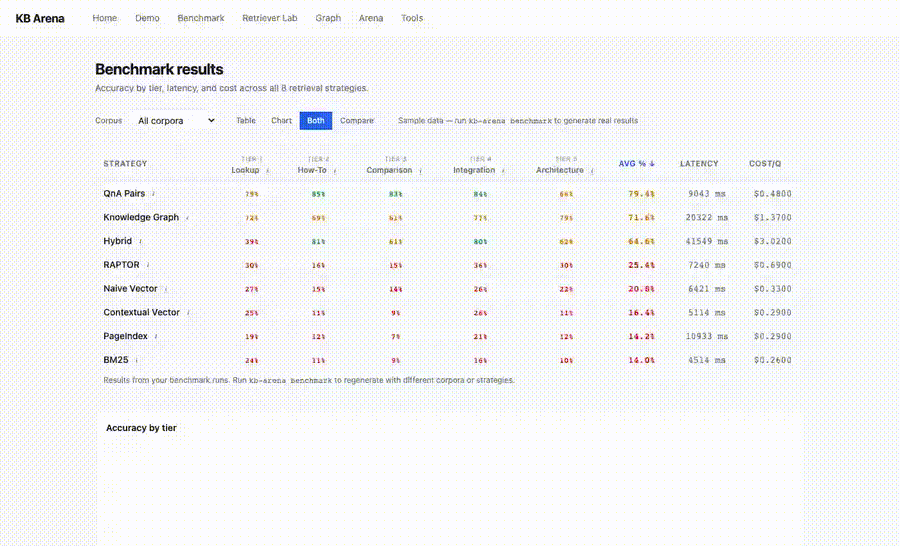

# KB Arena

> **Should you use Graph RAG, Vector RAG, or Hybrid?**
> KB Arena tells you — empirically, on your own docs.

Nine retrieval architectures. Your documentation. One winner.

KB Arena is the only open-source benchmark that runs **architecturally distinct** retrieval strategies — naive vector, contextual vector, Q&A pairs, knowledge graph, hybrid (RRF-fused), RAPTOR, PageIndex, BM25, and **rerank-vector** (cross-encoder reranking) — head-to-head on your own corpus, with auto-generated questions across 5 difficulty tiers, IR metrics (Recall@k, MRR, NDCG@k), RAGAS metrics, ELO arena voting, a CI gate, and a strategy plugin system.

Embeddings: pluggable across **OpenAI, Voyage-3, Cohere, Gemini, BGE (local), Ollama (local)** via `KB_ARENA_EMBEDDING_PROVIDER`. Rerankers: **BGE-v2-m3 (local), Cohere Rerank, Voyage Rerank** via `KB_ARENA_RERANKER_BACKEND`.

      [](https://zenodo.org/badge/latestdoi/1182030516)


---

## Try It in 10 Seconds (no API keys)

```bash
pip install kb-arena
kb-arena demo
```

This launches the dashboard with pre-computed results from the AWS Compute corpus (75 questions, 9 strategies, 5 difficulty tiers). The demo runs in **read-only mode** — chat, arena, and tools endpoints stay disabled until you set an API key. No Docker, no Neo4j, no surprises.



To enable live chat / arena voting / tools, set `KB_ARENA_ANTHROPIC_API_KEY` (or `KB_ARENA_OPENAI_API_KEY`, or use `KB_ARENA_LLM_PROVIDER=ollama` for free local inference).

## No-API-Keys Quick Start (Ollama)

```bash
# Free local inference — no Anthropic/OpenAI keys needed
ollama pull llama3.1:8b
export KB_ARENA_LLM_PROVIDER=ollama
kb-arena init-corpus my-docs && cp ~/my-docs/*.md datasets/my-docs/raw/
kb-arena run --corpus my-docs        # one command, all stages, resumable
kb-arena serve
```

---

## How KB Arena Differs from Other RAG Evaluation Tools

Most RAG evaluation tools answer "how well does my pipeline work?" KB Arena answers a different question: "which retrieval architecture works best for my docs?"

| | KB Arena | AutoRAG | RAGAS | MTEB / BEIR | GraphRAG | DeepEval |
|---|---|---|---|---|---|---|
| Compares multiple architectures | Yes - 9 strategies | Yes - module combos | No - evaluates your existing pipeline | No - compares embedding models | No - only their own approach | No |
| Automated hyperparameter search | Yes - `kb-arena optimize` (v0.7.0) | Yes | No | No | No | No |
| Includes graph + vector + hybrid | Yes | No - vector/keyword only | Vector/hybrid only | Embeddings only | Graph only | Any |
| Works on your own docs | Yes | Yes | Yes | No - fixed public datasets | No - fixed datasets | Yes |
| Auto-generates benchmark questions | Yes - 5 difficulty tiers | No - bring your own | Manual | Fixed | Fixed | Manual |
| Interactive comparison UI | Yes - chatbot + benchmark explorer | No - CLI/YAML only | No | Leaderboard only | No | Dashboard |
| Chatbot per strategy | Yes | No | No | No | No | No |
| Standard IR metrics (NDCG, MRR) | Yes - Retriever Lab, incl. graph (v0.7.0) | Yes | Yes | Yes | Partial | No |

AutoRAG is the only tool that also searches retrieval configurations. KB Arena adds what it can't: knowledge-graph retrieval as a first-class strategy, auto-generated questions, an interactive UI, and graph IR metrics.

If you want to know whether a knowledge graph, Q&A pairs, or plain vector search is the right architecture for your documentation, that's what KB Arena is for.

---

## What's New in v0.8.0 — Statistical-rigor metrics layer

`optimize` used to report "improved: True, delta=+0.0033" with no honesty layer. v0.8.0 fixes that and adds the metrics every IR benchmark since 2010 expects.

### New ranking metrics (`ir_metrics`)

- **MAP / Average Precision** — the BEIR/MTEB/TREC default. Captures *where* in the ranking the relevant items sit, weighted by precision at each hit. Reported per query and aggregated.
- **R-Precision** — precision at rank R where R = number of relevant items for that query. Removes the arbitrary fixed-k choice when comparing across queries with very different relevance-set sizes.
- **bpref** (Buckley & Voorhees 2004) — robust to incomplete judgment pools. aws-compute labels 35 of 75 questions; MAP silently penalizes systems for surfacing the unjudged-but-truly-relevant ones, bpref does not. Auto-clamps the inner term to [0,1] (a real-run bug surfaced exactly the case the canonical TREC formulation guards against).
- **Graded NDCG with exponential gain** (`2^rel - 1`, Burges et al.) — amplifies the penalty for mis-ranking a highly-graded item against a low-graded one. Switched via `ndcg_at_k(..., exponential_gain=True)`. Equivalent to linear for binary labels; takes effect once `expected_chunks.yaml` carries grades.

### New: Rank-Biased Overlap (`rank_similarity.py`)

```python
from kb_arena.benchmark.rank_similarity import rank_biased_overlap
rbo = rank_biased_overlap(naive_vector_ranks, contextual_vector_ranks, p=0.9)
```

Webber, Moffat & Zobel 2010 (extrapolated form). Compares two ranked lists **without ground truth** — answers "are these two strategies actually different in what they surface?", "did the new release perturb rankings beyond what we expected?", "is hybrid actually fusing or just mirroring vector?". `p=0.9` is the SIGIR default; identical rankings give 1.0 regardless of evaluation depth.

### `optimize` is honest now

Every `optimize` report gains:

- **95% bootstrap CIs** on the best score *and* the baseline (Sakai's IR standard). The score column now reads `0.3091 [0.224, 0.396]`.
- **Wilcoxon paired p-value** between best and baseline + a `significant` flag (p<0.05 AND positive lift). On the BM25 aws-compute sweep this surfaces `+0.0306 (p=0.0095) → significant=True`; a noisy `+0.003` lift would correctly be flagged not significant.
- **Win-rate vs baseline** — fraction of questions where the best config strictly beats the baseline. A high mean lift driven by a few big wins shows up as low win-rate; a robust improvement shows up high.
- **NDCG / ms** — efficiency metric (retrieval-time; cost in dollars is dominated by negligible embedding cost in retrieval-only mode).
- **Pareto frontier across strategies** — strategies not dominated on both (score, score/ms) get a `★` in the table.

### `retriever-lab` gets per-tier IR breakdown

The JSON now ships `by_tier: {1: {...}, 2: {...}, ..., 5: {...}}` for every strategy — Recall@k / NDCG@k / MAP / bpref split by difficulty tier. Does the win hold on hard queries, or is it carried by easy lookups? You can now answer that without re-running the benchmark per tier.

### scipy is now a runtime dep

For `scipy.stats.bootstrap` and `scipy.stats.wilcoxon`. ~50MB on top of the existing stack; dwarfed by chromadb/anthropic deps. Worth it for honest reporting.

617 tests, all TDD.

---

## What's New in v0.7.0 — Automated strategy search + graph IR metrics

Two changes that close the only gaps a direct competitor (AutoRAG) had on us, and fix the most visible methodological hole in our own numbers.

### New: `kb-arena optimize` — automated retrieval-strategy search

Stop guessing chunk size, top-k, embedding provider, or reranker backend. `optimize` sweeps them per strategy, scores each configuration on a retrieval IR metric, and reports the tuned optimum and its delta versus your current defaults.

**Prepare the corpus first.** `optimize` scores real retrieval, so the same pipeline as `benchmark`/`retriever-lab` must have run once. `--dry-run` (the search-space/cost preview) needs none of this — only a real run does.

```bash
kb-arena init-corpus my-docs
cp ~/my-docs/*.md datasets/my-docs/raw/

kb-arena ingest datasets/my-docs/raw/ --corpus my-docs      # raw docs → Document JSONL
kb-arena build-vectors --corpus my-docs                       # vector/RAPTOR/PageIndex/BM25 indexes
kb-arena build-graph --corpus my-docs                         # Neo4j graph (only if sweeping knowledge_graph/hybrid)
kb-arena generate-questions --corpus my-docs --count 50        # benchmark questions
kb-arena label-chunks --corpus my-docs                         # chunk-level ground truth for the IR metric
                                                               # (skip and optimize falls back to weaker doc-level scoring)
```

```bash
# Preview the search space and cost — no API keys, no corpus prep needed
kb-arena optimize --corpus my-docs \
  --strategies naive_vector,rerank_vector \
  --top-ks 3,5,10 --chunk-sizes 256,512,1024 \
  --embedding-providers openai,bge --dry-run

# Run it (needs the prepared corpus above)
kb-arena optimize --corpus my-docs --top-ks 3,5,10 --metric ndcg
```


- **Scoped sweeps.** Each strategy only sweeps the dimensions it actually consumes — BM25 sweeps top-k only, `rerank_vector` adds the reranker backend, chunking strategies add chunk size. No wasted trials.
- **Honest delta.** The current-settings configuration is always trial #1, so the reported lift is measured against what you ship today, not the worst trial.
- **Retrieval-only scoring.** Generation is stubbed, so a full sweep is ~10x cheaper than the answer benchmark — same primitive as Retriever Lab.
- **`grid` or `random`** search, `--max-trials` cap, seeded RNG for reproducibility, `--dry-run` cost preview that needs no credentials.
- **Isolated rebuilds.** A chunk/embedding sweep builds into a throwaway ChromaDB path — your persistent indexes are never touched.

This is the AutoRAG-parity feature: KB Arena now searches configurations *and* keeps graph retrieval, auto-generated questions, and the UI that AutoRAG doesn't have.

### Real numbers — aws-compute corpus, top-k sweep (run `bae5919b`)

A real `kb-arena optimize --corpus aws-compute --strategies bm25,naive_vector,contextual_vector,raptor --top-ks 3,5,10 --metric ndcg` run on the bundled AWS Compute corpus (75 questions, 35 with chunk-level ground truth):

| Strategy | default NDCG@5 | best NDCG | delta | best top-k |
|---|---:|---:|---:|---:|
| `contextual_vector` | 0.3876 | **0.4039** | **+0.0163** | 10 |
| `bm25` | 0.2785 | **0.3091** | **+0.0306** | 10 |
| `naive_vector` | 0.3671 | 0.3704 | +0.0033 | 10 |
| `raptor` | 0.3671 | 0.3704 | +0.0033 | 10 |

`top_k=10` wins everywhere on this corpus — the default `5` is leaving real lift on the table, biggest for `bm25` (+11% relative) and `contextual_vector` (+4% relative). `naive_vector` and `raptor` match because RAPTOR's L0 layer is the same chunks; the multi-level summary tree doesn't pay off at top-k≥3 on a small corpus. Pure top-k sweep finished in ~5 minutes total; no rebuilds, no embedding re-cost. Reproduce with the command above.

### Fixed: knowledge graph now scores real IR metrics

The `knowledge_graph` strategy previously scored a flat **0.0** on every Retriever Lab metric. It emitted `chunk_id="graph:{entity_fqn}"` (e.g. `graph:aws.lambda`) while ground truth is section-level (`lambda-overview::aws-lambda`) — the two could never match, so the headline graph strategy looked broken in our own table.

v0.7.0 carries each entity's source provenance end to end: extraction stamps `source_doc_id`, the loader persists it, every entity-returning Cypher template (and the Text-to-Cypher fallback) returns `source_doc_id` + `source_section_id`, and retrieval emits `graph:{doc}::{section}`. That maps a retrieved entity back to its source section, so the existing section-level ground truth matches and graph retrieval reports non-zero Recall@k / MRR / NDCG@k. Regenerate with `kb-arena retriever-lab --corpus aws-compute` after a graph build; the v0.5.0 table below is the pre-fix historical snapshot.

`KB_ARENA_CHUNK_TOKENS` / `KB_ARENA_CHUNK_OVERLAP_TOKENS` are now real settings (every token-chunking strategy reads them), which is also what lets `optimize` sweep chunk size.

617 tests.

---

## What's New in v0.6.0 — Hardening, 9th strategy, embedding providers, public leaderboard

A focused release that closes the four ship-blocker classes from a multi-dimension audit and adds three differentiated capabilities. Headline numbers in the README are now backed by code that does what it says.

### New: 9th strategy — `rerank_vector`

Naive Vector retrieval at top-`k`×4, rescored by a cross-encoder, regenerated on the post-rerank top-k. Three backends, all selected via `KB_ARENA_RERANKER_BACKEND`:

- `bge` — BAAI/bge-reranker-v2-m3, **local, free, no key**, default
- `cohere` — Cohere Rerank v3.5 / v4
- `voyage` — Voyage Rerank 2.5

The 2026 RAG consensus is that a reranker is the highest-leverage production accuracy lever. KB Arena now lets you benchmark every architecture *with and without* one, on your own corpus.

### New: embedding provider abstraction

`KB_ARENA_EMBEDDING_PROVIDER` selects the embedding backend used by every vector strategy:

| Provider | Why pick it |
|---|---|
| `openai` (default) | text-embedding-3-large |
| `voyage` | Current MTEB retrieval leader (+10.58% over OpenAI at matched dims) |
| `cohere` | Cohere embed-v4 |
| `bge` | BAAI/bge-large-en-v1.5 — **local, no key**, on-prem-friendly |
| `ollama` | Local via Ollama, no key |
| `gemini` | text-embedding-004 |

Unblocks privacy / on-prem teams (federal, healthcare, finance) and Gemini-shop / Bedrock-shop deployments.

### New: `kb-arena run --resume`

Replaces the seven-step pipeline with one resumable command. Each stage writes a checkpoint to `datasets/{corpus}/.pipeline_state.json`; a flaky LLM call no longer means starting over.

```bash
kb-arena run --corpus my-docs --docs ~/my-docs/   # one shot
kb-arena run --corpus my-docs --resume            # pick up where it stopped
```

### New: public leaderboard

`/api/leaderboard` aggregates every benchmark run in `results/run_*` per (corpus, strategy) with mean accuracy, Recall@5, NDCG@5, cost, and latency. Plus a Next.js `/leaderboard` page that consumes it. **No auth** — safe for hosted deploys; the static dashboard, leaderboard, benchmark results, and corpora endpoints stay available even when chat is locked down.

### Hardened: never drains your credits

The hosted-demo cost-bomb path is closed. New defaults:

- `KB_ARENA_API_TOKEN` — when set, every LLM endpoint requires `Authorization: Bearer …` (constant-time compared)
- `KB_ARENA_DEMO_MODE` — auto-enabled when no API key is configured; chat / arena / tools return 503 while the static surfaces keep working
- `Field(max_length=4000)` on every user input + Pydantic models for the arena endpoints
- Default `KB_ARENA_BENCHMARK_COST_CAP_USD` flipped from 0 (unlimited) to **10.0**
- Bounded-deque rate limiter, optional `KB_ARENA_TRUSTED_PROXY_HEADER` for nginx / Cloudflare deployments

### Hardened: Cypher safety + SSRF

- Every Neo4j read path now opens a session with `default_access_mode=READ_ACCESS` — defense in depth at the Bolt protocol level
- Write regex tightened to also reject `apoc.create | merge | refactor | delete | remove | set | drop | iterate | cypher.runWrite | export | trigger`
- `kb-arena ingest <url>` rejects `file://`, private/loopback/link-local IPs (post-DNS), and AWS / GCE metadata hostnames; auto-redirect off, per-hop validation
- Dockerfile non-root user, HEALTHCHECK, `KB_ARENA_DEMO_MODE=true` baked in so a freshly built image cannot accidentally enable chat

### Fixed: Hybrid actually fuses passages, not answers

The procedural branch used to rerank already-generated answer strings — that explained the embarrassing 8% Recall@5 in the v0.5.0 table. v0.6.0 retrieves real `RetrievedChunk` content from each sub-strategy at top-`k`×2, fuses with **Reciprocal Rank Fusion (k=60)** (which the README has always claimed), regenerates over the fused context, and runs the vector + graph queries with `asyncio.gather`. IntentRouter is now wired into `get_strategy("hybrid")` so the advertised three-stage classification actually fires.

### Fixed: cross-section graph edges

Knowledge-graph extraction used to drop every relationship pointing outside its section's batch — multi-hop queries were structurally impossible. v0.6.0 keeps cross-section edges and validates them against the global FQN union *after* every section has been extracted, restoring multi-hop reasoning.

### Fixed: ground-truth labelling no longer circular

`expected_chunks.yaml` candidates are now drawn from the union of BM25, naive vector, and contextual vector top-N (when those indexes exist). The previous BM25-only pool biased Recall@5 in favour of keyword-overlap strategies — closes the methodological critique.

### Fixed: cross-tenant data leak

Strategy `last_*` instance fields were stomped by concurrent SSE consumers — two simultaneous chat requests could see each other's sources. Per-call metrics now ride the streamed token sequence as a `_kb_arena_meta` packet; the legacy fields stay only for plugin back-compat.

### Demo polish

- `kb-arena demo` truly zero-config — `LLMClient` init is tolerant of missing keys, `demo_mode` auto-enables, dashboard loads instantly
- `aws-compute_bm25.json` is bundled (was missing in v0.5.0 — the 8th strategy showed empty in fresh installs)
- README hero rewritten with the question-frame pitch, plus a No-API-Keys Quick Start using Ollama
- Re-recorded hero GIF + UI walkthrough GIF + retriever-lab CLI GIF, all driven by checked-in `vhs` tape scripts in `docs/tapes/`
- `kb-arena --version` flag

### Roadmap (Phase 3 — prepped, not yet published)

- Public Arena Mode with ELO at `kb-arena.dev/arena` — "Chatbot Arena, but for RAG architectures"
- Hosted demo at `kb-arena.dev` (Vercel + fly.io configs in `deploy/`)
- BEIR / MTEB native dataset adapter, ColBERTv2 strategy via RAGatouille, Self-RAG / CRAG agentic strategies, OpenTelemetry tracing

---

## What's New in v0.5.0 — Retriever Lab

Classical IR metrics computed at the chunk level. See exactly which chunks each strategy surfaced, which it missed, and why one strategy beats another at a metric level — not just at the answer level.


### Metrics

`Recall@k`, `Precision@k`, `Hit@k`, `MRR`, `NDCG@k` — computed for every benchmark query, aggregated per strategy, rendered in the Markdown report.

### `kb-arena retriever-lab`

Retrieval-only benchmark. Skips LLM generation, runs ~10x cheaper than `kb-arena benchmark`. Streams a live Rich table of metrics as each strategy completes. Writes per-question chunk-level results to `results/run_{id}/retriever_lab.json`.

```bash
kb-arena label-chunks --corpus aws-compute     # Generate ground truth (BM25 + Haiku judge)
kb-arena retriever-lab --corpus aws-compute    # Live IR metrics, no LLM cost
```

### `/retriever-lab` web page

Aggregate metrics card per strategy plus per-question drill-down. Click a question, see the chunks each strategy surfaced with rank, score, and HIT/MISS badges so you can tell at a glance where retrieval breaks down.


### Real numbers — aws-compute corpus, run `855aac4e`

35 of 75 questions have chunk-level ground truth (the corpus only covers Lambda, API Gateway, ECS Fargate; the other 40 questions reference services not in the demo corpus, so their metrics fall to 0 — a useful coverage signal in itself).

| Strategy | Recall@5 | Precision@5 | Hit@5 | MRR | NDCG@5 |
|---|---|---|---|---|---|
| **contextual_vector** | **35.5%** | **24.5%** | 46.7% | **0.433** | **0.388** |
| naive_vector | 35.2% | 23.2% | 46.7% | 0.414 | 0.367 |
| raptor | 35.2% | 23.2% | 46.7% | 0.414 | 0.367 |
| bm25 | 27.5% | 17.1% | 44.0% | 0.352 | 0.278 |
| hybrid | 8.0% | 4.8% | 9.3% | 0.093 | 0.086 |
| pageindex | 6.1% | 5.0% | 14.7% | 0.111 | 0.076 |
| qna_pairs | 0.0% | 0.0% | 0.0% | 0.000 | 0.000 |
| knowledge_graph | 0.0% | 0.0% | 0.0% | 0.000 | 0.000 |

Contextual Vector edges out Naive Vector on ranking quality (MRR / NDCG) thanks to heading-path prefixes; Hybrid drops because the knowledge_graph leg is mocked when Neo4j isn't connected; QnA Pairs operates on Q-A identity, not section identity, so it needs doc-level labels (see `docs/retriever-lab.md` for interpretation).

### Roadmap

- v1.1: reranker comparison (cross-encoder vs. cohere-rerank vs. bge-reranker)

---

## What's New in v0.4.0

### RAGAS Metrics

Industry-standard evaluation metrics alongside the existing LLM judge. Enable with `--ragas` or `KB_ARENA_BENCHMARK_ENABLE_RAGAS=true`.


Adds four metrics per question: **faithfulness** (answer grounded in context), **context precision** (retrieved chunks are relevant), **context recall** (context covers the reference), and **answer relevancy** (answer addresses the question).

### Reference-Free Evaluation

Benchmark without pre-written ground truth -- useful for quick evaluation of new corpora before investing in question generation.


Scores on faithfulness and answer relevancy only (no accuracy/completeness since there's no reference to compare against).

### Strategy Plugin System

Bring your own retrieval strategy without forking. Your module exports a single `Strategy` subclass with `build_index()` and `query()` methods.


### CI/CD Eval Command

Gate merges on retrieval quality. Exits non-zero if any strategy falls below thresholds. Pair with `--format json` for machine-readable output.


### Cost Cap

Halt a benchmark run automatically if cumulative cost exceeds your budget. Set via `KB_ARENA_BENCHMARK_COST_CAP_USD`.


### Dry-Run Cost Estimates

Preview query counts, estimated cost, and estimated time before committing to a full benchmark run.


### Debug Endpoint

Trace the full retrieval pipeline -- intent classification, retrieved sources, latency breakdown, and cost -- without generating a final answer.


### Readiness Probe

The `/ready` endpoint returns 503 if Neo4j is configured but unreachable. Use as a k8s readiness probe or Docker healthcheck.


### Side-by-Side Strategy Comparison

New "Compare" view in the benchmark UI lets you pick two strategies and see tier-by-tier accuracy, latency, and cost differences side by side.


### Other Reliability Improvements

- **Exponential backoff** -- benchmark retries use `1s, 2s, 4s` instead of linear `1s, 2s, 3s`
- **Embedding retry** -- OpenAI embedding API calls retry 3x with exponential backoff and 30s timeout
- **Eval memoization** -- identical answer+reference pairs are scored once and cached
- **Arena JSONL** -- append-only vote log at `results/arena_votes.jsonl` survives state resets
- **Corpus validation** -- tightened from denylist to regex allowlist `^[a-zA-Z0-9_-]+$`

---

## What's New in v0.3.1

### Production Hardening

Session management, error handling, and API configuration improvements for real deployments:

- **Session ID support** -- pass `X-Session-ID` header instead of relying on IP-based sessions. Fixes shared proxy and network-switching issues.
- **Session TTL** -- idle sessions are automatically evicted (default 30 min, configurable via `KB_ARENA_SESSION_TTL_MINUTES`)
- **CORS configuration** -- set allowed origins via `KB_ARENA_CORS_ORIGINS` env var instead of hardcoded localhost
- **Corpus validation** -- graph build API validates corpus exists with processed documents before starting
- **Specific exception handling** -- Neo4j connection errors, graph extraction failures, and stream errors now catch specific types instead of bare `except Exception`

### Streaming Cost Tracking

OpenAI and Ollama providers now capture token usage after streaming completes -- previously only Anthropic tracked streaming costs. The chatbot demo now reports accurate `cost_usd` for all three providers.

### Faster QnA Index Building

Q&A pair generation during `build-vectors` is now parallelized with `asyncio.gather()` (5 concurrent). Building QnA indexes on large corpora is up to 5x faster.

### Custom Exception Hierarchy

New `kb_arena.exceptions` module with typed exceptions (`IngestError`, `GraphError`, `StrategyError`, `EvaluationError`, `LLMError`) for better error handling and debugging.

### Frontend Error Boundary

React error boundary wraps all page content -- API failures and render errors now show a recovery UI instead of a blank page.

### Graph Schema Cleanup

Removed dead Cypher templates that referenced non-existent relationship types (`DEPRECATED_BY`, `INHERITS`, `REQUIRES`, `EXAMPLE_OF`). Remaining templates now use only valid universal schema types.

---

## What's New in v0.3.0

### Multi-LLM Provider Support

No longer locked to Anthropic. Choose your LLM backend:

```bash
# Anthropic (default)
export KB_ARENA_LLM_PROVIDER=anthropic
export KB_ARENA_ANTHROPIC_API_KEY=sk-ant-...

# OpenAI
export KB_ARENA_LLM_PROVIDER=openai
export KB_ARENA_OPENAI_API_KEY=sk-...

# Ollama (free local inference)
export KB_ARENA_LLM_PROVIDER=ollama
```

Each provider has its own model mapping -- GPT-4o for generation, GPT-4o-mini for classification when using OpenAI; any local model when using Ollama.

### Strategy Arena - Blind A/B Comparison

A new **Arena mode** for blind head-to-head strategy battles. Ask a question, two random strategies answer it, you vote for the better response. ELO ratings emerge over time.

```bash
kb-arena serve  # then open /arena in your browser
```


### BM25 Baseline Strategy

Strategy #8: classic BM25 keyword matching. The pre-neural baseline that answers "do I even need embeddings for my docs?" Uses BM25Okapi scoring with LLM answer generation.

### Parallel Benchmark Execution

Strategies now run concurrently instead of sequentially. A full 8-strategy benchmark that took 60-90 minutes now completes in 15-25 minutes.

```bash
kb-arena benchmark --corpus my-docs              # parallel by default
kb-arena benchmark --corpus my-docs --no-parallel # sequential if needed
```

### Accurate Token Counting

Replaced whitespace tokenization with tiktoken (cl100k_base BPE). Chunk sizes are now measured in real tokens, not word counts. Previous "512-token chunks" were actually ~370 real tokens - now they're exactly 512.

### Cost Tracking Fixed

Fixed cost propagation across all multi-call strategies:
- Knowledge graph: Text-to-Cypher generation cost now tracked
- PageIndex: beam traversal LLM cost now accumulated
- Streaming: token usage captured via `get_final_message()`
- Latency decomposition: retrieval vs generation timing now measured separately

### Run Comparison

Benchmark runs now have unique IDs and timestamps. Results are preserved across runs instead of overwritten:

```bash
kb-arena benchmark --corpus my-docs
# Run ID: a1b2c3d4
# Results: results/run_a1b2c3d4/my-docs_naive_vector.json

kb-arena report --run-id a1b2c3d4
```

### CI/CD Integration

Fail your pipeline if retrieval quality drops:

```bash
kb-arena benchmark --corpus my-docs --fail-below 0.7
# Exit code 1 if any strategy's accuracy falls below 70%
```

### Export Formats

Generate reports in CSV or self-contained HTML:

```bash
kb-arena report --format csv    # spreadsheet-ready
kb-arena report --format html   # shareable dashboard
```

### Bundled Frontend

`kb-arena demo` now serves a complete dashboard -- no separate Next.js dev server needed. The static frontend is bundled with the pip package.

### Changelog

| Version | Date | Changes |
|---------|------|---------|
| 0.8.1 | 2026-05-21 | Release-only. Triggers the first Zenodo archive of the repo so the citation badge resolves to a real concept DOI. No code changes. |
| 0.8.0 | 2026-05-20 | Statistical-rigor metrics layer. ir_metrics gains **MAP / Average Precision**, **R-Precision**, **bpref** (TREC-style robust to partial labels, auto-clamped to [0,1] from a real-run bug surfaced on aws-compute), and a **graded NDCG** switch using exponential gain (2^rel-1) for SIGIR-standard handling of graded relevance. New `kb_arena/benchmark/rank_similarity.py` with **Rank-Biased Overlap** (Webber 2010, extrapolated form) for comparing two strategies' rankings without a gold standard. `optimize` now reports **bootstrap 95% CIs**, **Wilcoxon paired p-value + significance flag**, **win-rate vs baseline**, **NDCG/ms efficiency**, and **Pareto-optimal markers** across strategies — the report finally tells you whether a `+0.003` lift is real or noise. `retriever-lab` JSON gains **per-tier breakdowns** (Recall/NDCG/MAP per difficulty tier 1-5) and bootstrap CIs on aggregate means. scipy added as a runtime dep. 617 tests. |
| 0.7.1 | 2026-05-20 | `kb-arena optimize` correctness + first real numbers. Rebuild-decision bug: `needs_rebuild` was comparing to the *previous* trial (so trial #1 always rebuilt even when it equalled the baseline, needlessly re-embedding the corpus); now compared to the baseline (persistent-index config), so a pure top-k sweep does zero rebuilds. README v0.7.0 section gains a real `aws-compute` top-k sweep table (BM25 / naive_vector / contextual_vector / RAPTOR, NDCG baseline vs best vs delta) and the demo GIF now shows a real BM25 run streaming actual NDCG numbers, not just `--dry-run`. Corpus-prep recipe documented in the optimize section. 617 tests. |
| 0.7.0 | 2026-05-19 | Automated retrieval-strategy search (`kb-arena optimize`): scoped grid/random sweeps over chunk size, top-k, embedding provider, reranker backend per strategy; retrieval-only scoring (~10x cheaper than `benchmark`); honest delta vs. current defaults; `--dry-run` cost preview (no keys); isolated per-trial ChromaDB so sweeps never touch persistent indexes. Graph IR fix: entities now carry `source_doc_id`/`source_section_id` end to end (extractor → Neo4j → Cypher templates → retrieval), so `knowledge_graph` emits `graph:{doc}::{section}` and scores real Recall@k/MRR/NDCG@k instead of a flat 0.0. `KB_ARENA_CHUNK_TOKENS`/`KB_ARENA_CHUNK_OVERLAP_TOKENS` are now first-class settings. 617 tests. |
| 0.6.1 | 2026-05-02 | Docs-only — adds the missing "What's New in v0.6.0" section, bumps strategy count to 9 across the README, lists `rerank_vector` in the strategy table. No code changes from v0.6.0. |
| 0.6.0 | 2026-05-02 | Hardening + 9th strategy + embedding providers + public leaderboard. New `rerank_vector` strategy with BGE/Cohere/Voyage backends. Embedding provider abstraction (OpenAI/Voyage/Cohere/BGE/Ollama/Gemini). One-shot `kb-arena run --resume` orchestrator. Public read-only `/api/leaderboard` + `/leaderboard` page. Bearer-token auth + demo-mode + 4000-char input cap on every LLM endpoint. Default cost cap 0 → 10 USD. Cypher sessions opened READ_ACCESS, APOC write regex tightened. WebParser SSRF guard. Hybrid procedural rewritten to fuse real passages via RRF (was reranking answer strings). IntentRouter actually wired in. Cross-section graph edges no longer dropped. Ground-truth pool widened from BM25-only. Cross-tenant strategy state leak fixed. BM25 result file bundled. Re-recorded demo GIFs. 558 tests. |
| 0.5.0 | 2026-04-26 | Retriever Lab — classical IR metrics (Recall@k, Precision@k, Hit@k, MRR, NDCG@k) computed per query, `RetrievalTrace` exposes retrieved chunks per strategy with rank+score, `kb-arena retriever-lab` retrieval-only command (~10x cheaper than `benchmark`), `kb-arena label-chunks` BM25+Haiku ground-truth generator, `--top-k` flag on `benchmark`, `/retriever-lab` web page with HIT/MISS drill-down, hierarchical chunk-id matching, 558 tests |
| 0.4.0 | 2026-04-04 | RAGAS metrics (faithfulness, context precision/recall, answer relevancy), reference-free eval mode, LLM eval memoization, cost cap enforcement, strategy plugin system (`--strategy-module`), CI/CD eval command (`kb-arena eval --ci`), debug/explain endpoint, `/ready` health probe, exponential backoff on retries, embedding API retry+timeout, arena ELO JSONL persistence, side-by-side strategy comparison UI, benchmark dry-run cost estimates, tightened corpus validation |
| 0.3.1 | 2026-03-26 | Production hardening (session IDs, TTL, CORS config, corpus validation), streaming cost for OpenAI/Ollama, parallel QnA build, custom exceptions, error boundary, graph schema cleanup, 494 tests |
| 0.3.0 | 2026-03-20 | Multi-LLM providers (Anthropic/OpenAI/Ollama), Strategy Arena, BM25 strategy, parallel benchmarks, tiktoken chunking, cost tracking fixes, run comparison, CI fail-below, CSV/HTML export, bundled frontend |
| 0.2.1 | 2026-03-03 | PageIndex strategy, verbose mode, retry logic, parallel extraction, eval independence |
| 0.2.0 | 2026-02-28 | RAPTOR strategy, hybrid improvements, 7 strategies total |
| 0.1.0 | 2026-02-20 | Initial release: 5 strategies, benchmark engine, chatbot demo |

---

## Quick Start -- I Just Have My Docs

You have documentation files (markdown, HTML, text, PDFs). You want to know which retrieval strategy works best. Here's everything from zero.

### Prerequisites

1. **Python 3.11+** and **pip**
2. **Docker** (for Neo4j — the knowledge graph strategy needs it)
3. **API keys** for your LLM provider (Anthropic, OpenAI, or Ollama) and OpenAI (embeddings)

That's it. No Neo4j expertise needed. No graph database experience required. KB Arena handles the schema, extraction, and querying.

### Step 1: Install

```bash
pip install kb-arena

# Optional: install format-specific parsers
pip install kb-arena[pdf]        # PDF support (PyMuPDF)
pip install kb-arena[docx]       # Word documents (mammoth)
pip install kb-arena[web]        # Web scraping (httpx)
pip install kb-arena[all-formats] # All of the above
```

### Step 2: Set API keys

Create a `.env` file or export directly:

```bash
export KB_ARENA_ANTHROPIC_API_KEY=sk-ant-...    # Claude for generation + evaluation
export KB_ARENA_OPENAI_API_KEY=sk-...           # OpenAI for text-embedding-3-large
```

### Step 3: Start Neo4j

KB Arena uses Neo4j for the knowledge graph strategy. One command:

```bash
docker compose up neo4j -d
```

This starts Neo4j on `localhost:7687` with default credentials (`neo4j` / `kbarena1`). No configuration needed — KB Arena creates the schema automatically.

If you don't have the `docker-compose.yml`, create one:

```yaml
services:
  neo4j:
    image: neo4j:5-community
    ports:
      - "7474:7474"
      - "7687:7687"
    environment:
      - NEO4J_AUTH=neo4j/kbarena1
      - NEO4J_PLUGINS=["apoc"]
    volumes:
      - neo4j_data:/data

volumes:
  neo4j_data:
```

**Don't want Docker?** KB Arena still works — the vector strategies, RAPTOR, and PageIndex run without Neo4j. Only the knowledge graph and hybrid strategies need it.

### Step 4: Run the pipeline

```bash
# Scaffold a new corpus
kb-arena init-corpus my-docs

# Drop your docs into the raw/ directory
cp ~/my-documentation/*.md datasets/my-docs/raw/
# Supports: .md, .html, .txt, .pdf, .docx, .csv, .tsv — auto-detected

# Parse into the unified Document model (JSONL intermediate files)
kb-arena ingest datasets/my-docs/raw/ --corpus my-docs

# Or ingest directly from a URL or GitHub repo
kb-arena ingest https://docs.example.com --corpus my-docs
kb-arena ingest github:owner/repo --corpus my-docs

# Build the knowledge graph in Neo4j (entities + relationships)
kb-arena build-graph --corpus my-docs

# Build vector indexes in ChromaDB (local, no server needed)
kb-arena build-vectors --corpus my-docs

# Auto-generate benchmark questions from your docs (10 per difficulty tier)
kb-arena generate-questions --corpus my-docs --count 50

# Run the benchmark (each question x 9 strategies, 4-pass evaluation)
kb-arena benchmark --corpus my-docs

# Launch the web UI to explore results
kb-arena serve
```

Open `http://localhost:8000` for the API, `http://localhost:3000` for the dashboard.

### Step 5: Read the results

The benchmark produces:
- **Accuracy by tier** — which strategy handles simple lookups vs multi-hop architecture questions
- **Latency percentiles** — p50, p95, p99 per strategy
- **Cost per query** — token usage and API cost
- **Composite ranking** — 0.5 * accuracy + 0.3 * reliability + 0.2 * latency

Results are saved to `results/` as JSON and displayed in the web dashboard.

---

## Full Stack with Docker Compose

Run everything — Neo4j, the API server, and the frontend — in one command:

```bash
# Set your API keys
export ANTHROPIC_API_KEY=sk-ant-...
export OPENAI_API_KEY=sk-...

# Start all services
docker compose up -d

# Open the dashboard
open http://localhost:3000
```

The compose file starts Neo4j (port 7474/7687), the FastAPI backend (port 8000), and the Next.js frontend (port 3000).

---

## Using the Built-in AWS Example

The AWS Compute corpus ships ready to use (75 questions across 5 difficulty tiers):

```bash
kb-arena ingest ./datasets/aws-compute/raw/ --corpus aws-compute
kb-arena build-graph --corpus aws-compute
kb-arena build-vectors --corpus aws-compute
kb-arena benchmark --corpus aws-compute
kb-arena label-chunks --corpus aws-compute        # v0.5.0: ground truth for IR metrics
kb-arena retriever-lab --corpus aws-compute       # v0.5.0: classical IR metrics, no LLM cost
kb-arena serve
```

---

## Screenshots

**Home** — Overview of the 9 strategies, difficulty tiers, and evaluation methodology.


**Strategy comparison** — Ask the same question to all 9 strategies simultaneously. Compare answers, sources, latency, and cost side-by-side.


**Benchmark results** — Accuracy table by tier with grouped bar chart.


**Knowledge graph** — Interactive force-directed visualization of entities extracted from your docs.


**Live graph build** — Watch entities and relationships stream in as the extractor runs.


---

## Documentation Tools

Beyond benchmarking, KB Arena includes three standalone tools that work on any documentation corpus.

All three tools are available as CLI commands and through the web UI at `/tools`.

### Q&A Generator

Generate Q&A pairs from your docs — use them for chatbot training, FAQ pages, or search indexes. Only needs an Anthropic key (no embeddings, no vector DB).

```bash
kb-arena generate-qa --corpus my-docs
# Outputs: datasets/my-docs/qa-pairs/qa_pairs.jsonl
```

**CLI**


**Web UI**


### Docs Gap Analyzer

Find what's missing in your documentation before your users complain about it. Generates Q&A pairs per section, self-evaluates them, and classifies each section as strong (>=70%), weak (30-70%), or gap (<30%).

```bash
kb-arena audit --corpus my-docs
```

**CLI**


**Web UI**


### Fix My Docs

Get actionable recommendations with draft content to improve your docs. Runs the audit internally, then generates prioritized fixes for weak and gap sections.

```bash
kb-arena fix --corpus my-docs --max-fixes 5
```

**CLI**


**Web UI**


Pipeline: `generate-qa` → `audit` → `fix` — each command builds on the previous. Or run them independently via CLI or the web UI.

---

## Benchmark Results (AWS Compute Corpus)

Real numbers from 75 questions across 5 difficulty tiers, evaluated with a 4-pass system (structural checks + LLM-as-judge):

| Strategy | Overall | T1 Lookup | T2 How-To | T3 Comparison | T4 Integration | T5 Architecture | Avg Latency | Cost |
|---|---|---|---|---|---|---|---|---|
| **Q&A Pairs** | **79.2%** | 79% | 85% | **83%** | **84%** | 66% | 9.0s | $0.48 |
| Knowledge Graph | 71.5% | 72% | 69% | 61% | 77% | **79%** | 20.3s | $1.37 |
| Hybrid | 64.7% | 39% | 81% | 61% | 80% | 62% | 41.5s | $3.02 |
| RAPTOR | 25.3% | 30% | 16% | 15% | 36% | 30% | 7.2s | $0.69 |
| Naive Vector | 20.7% | 27% | 15% | 14% | 26% | 22% | 6.4s | $0.33 |
| Contextual Vector | 16.5% | 25% | 11% | 9% | 26% | 11% | 5.1s | $0.29 |
| BM25 | 14.0% | 24% | 11% | 9% | 16% | 10% | 4.5s | $0.26 |
| PageIndex | 14.3% | 19% | 12% | 7% | 21% | 12% | 10.9s | $0.29 |

**Key takeaway:** Q&A pairs dominate overall because pre-generated answers sidestep retrieval failures. Knowledge graph leads on architecture questions (T5: 79%) where structured graph traversal shines. The hybrid strategy adapts per question type but pays a latency/cost premium. BM25 -- the pre-neural keyword baseline -- scores 14.0% overall at the lowest cost ($0.26), confirming that embeddings add meaningful value for this corpus. PageIndex -- the vectorless, reasoning-based approach -- scores comparably to contextual vector at $0.29, demonstrating that LLM tree traversal is a viable alternative to embeddings on well-structured docs. RAPTOR's hierarchical retrieval shows strength at T4/T5 but needs a larger corpus. Pure vector RAG -- what most teams ship -- scores under 21%. Cost ranges from $0.26 (BM25) to $3.02 (hybrid) for the full 75-question benchmark.

These are results from the built-in AWS Compute corpus. Your mileage will vary — that's the whole point of running it on your own docs.

---

## The 9 Strategies

| # | Strategy | How it works | Best at |
|---|----------|-------------|---------|
| 1 | **Naive Vector** | Chunk → embed → cosine similarity → generate | Fast lookups, simple factoid questions |
| 2 | **Contextual Vector** | Chunk + parent context → embed → rank | Disambiguating domain-specific terms |
| 3 | **Q&A Pairs** | LLM pre-generates Q&A at index time → match | Common questions with known answers |
| 4 | **Knowledge Graph** | Entities → Neo4j → Cypher templates → generate | Multi-hop dependencies, cross-topic queries |
| 5 | **Hybrid** | Intent routing → vector + graph fused via RRF | Adapts per question type |
| 6 | **RAPTOR** | Cluster chunks → LLM topic summaries → recursive tree → query all levels | Cross-document synthesis, broad topic questions |
| 7 | **PageIndex** | Build tree index from doc structure → LLM beam search traversal → no vectors | Well-structured docs, reasoning over hierarchy |
| 8 | **BM25** | Classic keyword matching (BM25Okapi) → LLM generation | Pre-neural baseline — "do I even need embeddings?" |
| 9 | **Rerank Vector** | Naive Vector at top-k×4 → cross-encoder rerank (BGE / Cohere / Voyage) → top-k → generate | The 2026 reranker question: "is the upgrade worth it on my docs?" |

---

## Question Tiers

Questions are organized into 5 difficulty tiers:

| Tier | Type | Hops | What it tests |
|------|------|------|---------------|
| 1 | Lookup | 1 | Single-fact lookup from one document |
| 2 | How-To | 1-2 | Multi-step processes, configuration sequences |
| 3 | Comparison | 2-3 | Comparing alternatives, trade-offs between options |
| 4 | Integration | 3-4 | Dependencies and connections between concepts |
| 5 | Architecture | 3-5 | Cross-document synthesis, transitive reasoning |

Use `kb-arena generate-questions` to auto-generate questions from your docs, or write them by hand in YAML.

---

## Supported Formats

| Format | Extensions / Input | Optional Dep | Notes |
|--------|-------------------|--------------|-------|
| Markdown | `.md`, `.markdown`, `.rst` | — | Heading hierarchy, code blocks, tables |
| HTML | `.html`, `.htm` | — | Strips nav/footer, extracts structure |
| Plain text | `.txt`, `.text` | — | ALL CAPS heading detection |
| PDF | `.pdf` | `kb-arena[pdf]` | Font-size heading detection, table extraction |
| Word | `.docx` | `kb-arena[docx]` | Converts to HTML, then extracts structure |
| CSV / TSV | `.csv`, `.tsv` | — | Auto-detects delimiter, groups rows into sections |
| Web URL | `https://...` | `kb-arena[web]` | Crawls same-domain pages; uses `/llms.txt` if available |
| GitHub | `github:owner/repo` | — | Shallow clones and ingests all doc files |
| SEC EDGAR | `--format sec-edgar` | — | 10-K/10-Q filing parser |

---

## Universal Documentation Schema

KB Arena extracts entities and relationships using a universal schema that works for any documentation domain:

**5 node types:** Topic, Component, Process, Config, Constraint
**7 relationship types:** DEPENDS_ON, CONTAINS, CONNECTS_TO, TRIGGERS, CONFIGURES, ALTERNATIVE_TO, EXTENDS

No per-domain configuration needed. The LLM maps your documentation concepts to these types automatically.

---

## CLI Reference

| Command | Description |
|---|---|
| `demo` | Launch dashboard with pre-computed results (no API keys needed) |
| `init-corpus <name>` | Scaffold `datasets/{name}/` directories |
| `ingest <path>` | Parse docs into JSONL. Accepts files, dirs, URLs, `github:owner/repo`. Options: `--corpus`, `--format`, `--dry-run` |
| `build-graph` | Extract entities/rels into Neo4j. Options: `--corpus` |
| `build-vectors` | Build vector indexes + PageIndex tree. Options: `--corpus`, `--strategy` |
| `generate-questions` | Auto-generate benchmark questions. Options: `--corpus`, `--count` |
| `benchmark` | Run evaluation. Options: `--corpus`, `--strategy`, `--tier`, `--dry-run` |
| `optimize` | Automated hyperparameter search per strategy. Options: `--corpus`, `--strategies`, `--top-ks`, `--chunk-sizes`, `--embedding-providers`, `--reranker-backends`, `--metric`, `--method` (grid/random), `--max-trials`, `--dry-run` |
| `generate-qa` | Generate Q&A pairs from your docs as JSONL. Options: `--corpus`, `--output` |
| `audit` | Find documentation gaps — classifies sections as strong/weak/gap. Options: `--corpus`, `--output`, `--max-sections` |
| `fix` | Generate fix recommendations with draft content. Options: `--corpus`, `--max-fixes`, `--output` |
| `report` | Generate report. Options: `--corpus`, `--output`, `--format` (rich/json) |
| `serve` | Launch API + frontend. Options: `--host`, `--port` |
| `health` | Pipeline status. Options: `--format` (rich/json) |

All commands are independently re-runnable. Each stage writes to disk so you can re-run any step without repeating earlier ones.

### CLI Features

**Dry run** — Preview what a command will do before committing to expensive LLM calls:

```bash
kb-arena ingest datasets/my-docs/raw/ --corpus my-docs --dry-run
# Shows: file count by extension, parser assignment, output path

kb-arena benchmark --corpus my-docs --dry-run
# Shows: question count, strategy list, total queries, concurrency settings
```


**JSON output** — Pipe structured data to `jq`, scripts, or CI pipelines:

```bash
kb-arena report --corpus my-docs --format json | jq '.corpora'
kb-arena health --format json | jq '.services'
```


**Pipeline hints** — After every command, see what to run next:

```
$ kb-arena ingest datasets/my-docs/raw/ --corpus my-docs
Done. 12 documents, 47 sections → datasets/my-docs/processed/documents.jsonl

Next: kb-arena build-graph --corpus my-docs && kb-arena build-vectors --corpus my-docs
```

**Progress bars** — Every long-running command shows real-time progress (extraction sections, Neo4j batch loading, vector index building, question generation tiers).

**Cost tracking** — Benchmark runs display cumulative API cost in the progress bar and print per-strategy cost/accuracy summaries after completion.

**Verbose mode** — Add `--verbose` / `-v` to any command for debug logging:

```bash
kb-arena benchmark --corpus my-docs --verbose
```

---

## Reliability and Performance

**LLM retry with backoff** — All Anthropic API calls retry up to 3 times with exponential backoff (1s, 2s, 4s) on rate limits, timeouts, and server errors. Every call has a 60-second hard timeout.

**Parallel graph extraction** — Entity/relationship extraction from document sections runs up to 5 sections concurrently (5-10x faster than sequential for large corpora).

**Parallel hybrid reranking** — The hybrid strategy's passage re-ranking runs all scoring calls concurrently using Haiku instead of sequential Sonnet calls (~50s to ~5s on procedural queries).

**Evaluation independence** — The LLM-as-judge evaluator uses a different model (`JUDGE_MODEL`, defaults to Opus) than the generation model (Sonnet) to avoid same-model scoring bias.

**Cypher safety** — LLM-generated Cypher queries are checked for write operations (`CREATE`, `MERGE`, `DELETE`, etc.) and blocked before execution. Only read queries reach Neo4j.

---

## Environment Variables

All prefixed with `KB_ARENA_`. Loaded from `.env` or environment.

| Variable | Default | Required | Description |
|----------|---------|----------|-------------|
| `ANTHROPIC_API_KEY` | — | Yes | Claude for generation, evaluation, extraction |
| `OPENAI_API_KEY` | — | Yes | OpenAI for text-embedding-3-large |
| `NEO4J_URI` | `bolt://localhost:7687` | No | Neo4j connection |
| `NEO4J_USER` | `neo4j` | No | Neo4j username |
| `NEO4J_PASSWORD` | — | No | Neo4j password (set to match `NEO4J_AUTH` in docker-compose) |
| `JUDGE_MODEL` | `claude-opus-4-6` | No | Model used for LLM-as-judge evaluation (default differs from generate model to avoid self-evaluation bias) |
| `CHROMA_PATH` | `./chroma_data` | No | ChromaDB storage path |
| `EMBEDDING_MODEL` | `text-embedding-3-large` | No | OpenAI embedding model |
| `EMBEDDING_DIMENSIONS` | `3072` | No | Embedding vector dimensions |
| `GENERATE_MODEL` | `claude-sonnet-4-6` | No | Generation model |
| `FAST_MODEL` | `claude-haiku-4-5-20251001` | No | Classification model |
| `HOST` | `0.0.0.0` | No | Server bind address |
| `PORT` | `8000` | No | Server port |
| `DEBUG` | `false` | No | Debug mode |
| `BENCHMARK_TEMPERATURE` | `0.0` | No | LLM temperature for benchmarks |
| `BENCHMARK_MAX_CONCURRENT` | `5` | No | Parallel benchmark queries |
| `BENCHMARK_QUERY_TIMEOUT_S` | `120` | No | Per-query timeout (seconds) |
| `BENCHMARK_MAX_RETRIES` | `2` | No | Retry count on failures |
| `PAGEINDEX_BEAM_WIDTH` | `3` | No | Branches to explore per tree level |
| `PAGEINDEX_MAX_DEPTH` | `4` | No | Maximum tree traversal depth |
| `DATASETS_PATH` | `./datasets` | No | Datasets directory |
| `RESULTS_PATH` | `./results` | No | Results output directory |

---

## Development

```bash
# Install with dev dependencies
pip install -e '.[dev]'

# Run tests
pytest tests/ -v --ignore=tests/live  # 617 tests

# Lint + format
ruff check . && ruff format --check .

# Frontend
cd web && npm install && npx next build
```

---

## Tech Stack

| Component | Technology |
|-----------|-----------|
| LLM | Claude Sonnet 4.6 (generation) + Haiku 4.5 (classification) |
| Embeddings | text-embedding-3-large (3072-dim) |
| Vector store | ChromaDB 0.5 (local, no server) |
| Graph store | Neo4j 5 Community |
| Backend | FastAPI + SSE streaming |
| Frontend | Next.js 14 + Tailwind + Recharts |
| Models | Pydantic v2 |
| CLI | Typer + Rich |
| Testing | pytest (617 tests) |

---

## Citation

If you use KB Arena in academic work, please cite it. Metadata lives in [`CITATION.cff`](CITATION.cff) and [`.zenodo.json`](.zenodo.json); GitHub's "Cite this repository" button will resolve the CFF directly, and every GitHub release is archived to Zenodo with a versioned DOI plus a concept DOI that always resolves to the latest release.

Plain-text reference:

```
Puspus, Xavier. KB Arena: a benchmark for retrieval architectures on
your own documentation. Version 0.8.1, 2026. https://github.com/xmpuspus/kb-arena
```

BibTeX (resolve the badge above for the version-specific DOI; the concept DOI is `10.5281/zenodo.PENDING` until Zenodo finishes archiving the first release):

```bibtex
@software{kb_arena_2026,
  author    = {Puspus, Xavier},
  title     = {KB Arena: a benchmark for retrieval architectures on your own documentation},
  year      = {2026},
  version   = {0.8.1},
  url       = {https://github.com/xmpuspus/kb-arena},
  doi       = {10.5281/zenodo.PENDING}
}
```

---

## License

MIT
